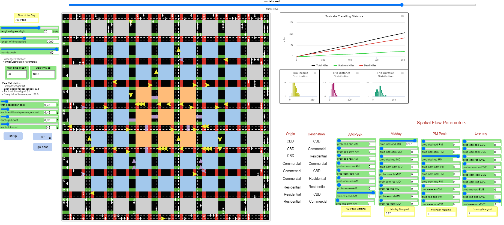
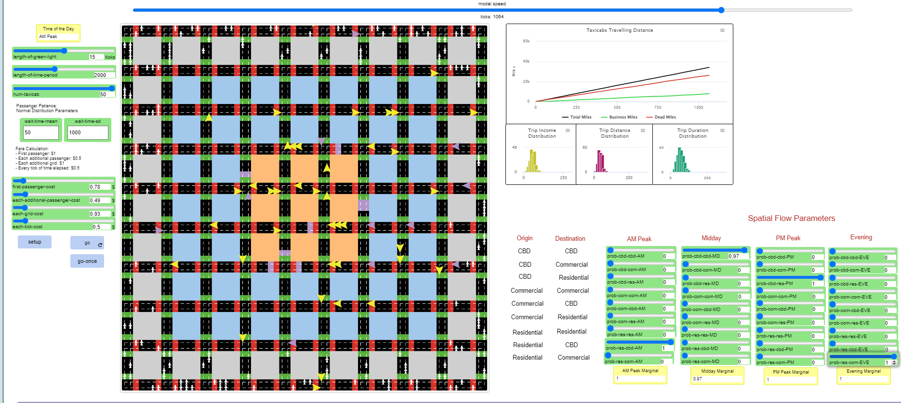
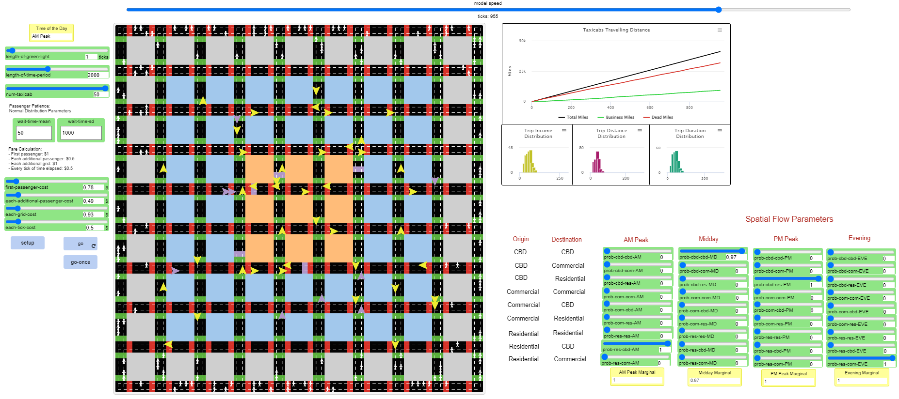
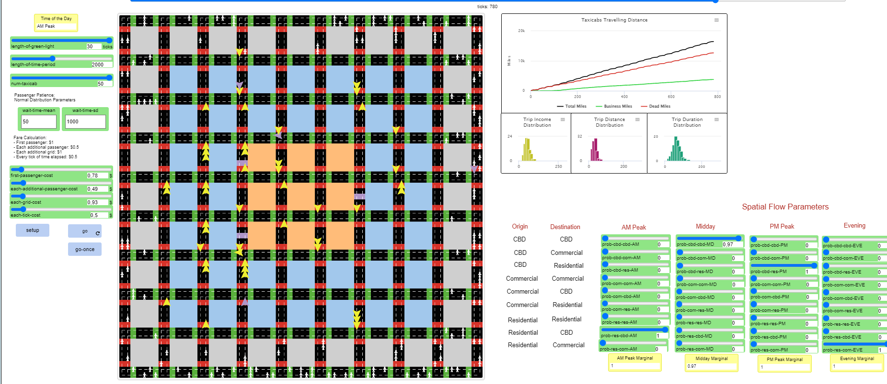
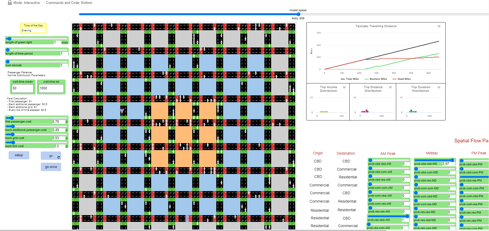

## Імітаційне моделювання комп'ютерних систем
## СПм-21-2, **Покора Костянтин Віталійович**
### Лабораторная работа №**1**. Описание имитационных моделей

 

### Выбранная модель в среде NetLogo:
[Taxi Cabs](https://www.netlogoweb.org/launch#https://www.netlogoweb.org/assets/modelslib/Sample%20Models/Social%20Science/Taxi%20Cabs.nlogo)

 

### Вербальное описание модели:
Модель имитирует работу такси в городской местности. Целью модели является получение информации о прибыльности такси на основе характеристик поездки и динамики спроса.

### Управляющие параметры:
- **NUM-TAXICABS** - управление количеством такси.
- **LENGTH-OF-TIME-PERIOD** - контролирует длину временного интервала.

### Внутренние параметры:
- **WAIT-TIME-MEAN** - количество времени которое ждет пассажир.
- **WAIT-TIME-SD** - количетство пассажиров ожидающее такси.
- **LENGTH-OF-GREEN-LIGHT** - длина светофоров.
- **FIRST-PASSENGER-COST, EACH-ADDITIONAL-PASSENGER-COST, EACH-GRID-COST и EACH-TICK-COST** - расчет стоимости поездок.

### Критерии эффективности системы:
- Значение параметров должно соответствовать реальности

### Недостатки модели:
- Поиск пассажиров случайным образом.

 

## Вычислительные эксперименты
### 1. При реальных параметрах возможно что бы бизнес мили обогнали мертвые мили? 

При любых параметрах в пределах схожими с реальностью бизнес мили не могут обогнать мертвые мили из-за недостатка модели. 

### 2. Влияет ли длинна зеленого светофора на бизнес мили?
При любом изменении длины зеленого светофора график остается практически не изменным.

Если ввести 1 такси и минимальную длину светофора то графики буду соприкасатся.

### 3. При каких параметрах бизнес мили обгонят мертвые мили? 
Если выкрутить параметры до нереальных можно добиться того что бы бизнес мили обогнали мертвые мили.

